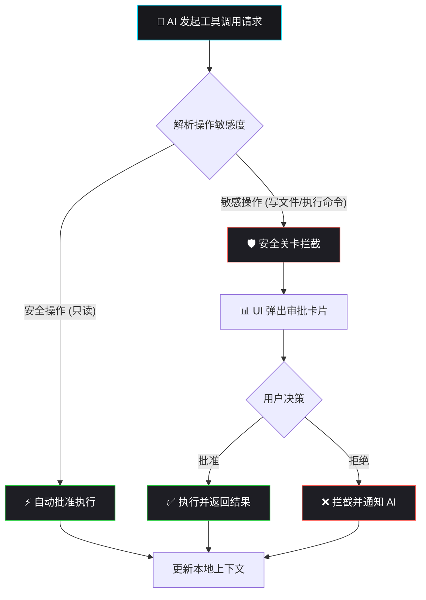

# 安全与审批流

DreamCoder 采用多层安全沙盒机制，确保 AI 在你的本地上下文中有序工作，同时保护你的数据隐私和系统安全。

## 核心设计理念

1. **本地数据优先**：所有 API Key 和会话数据仅存储在本地，不上传任何凭据到云端。
2. **操作可视化**：AI 的每一次文件读写、终端命令执行都会记录在日志中。
3. **权限审批流**：用户可配置不同级别的自动审批或手动确认。

## 审批流程拓扑

当 AI 代理尝试执行操作时，系统会根据当前配置的权限模式决定是自动执行还是弹窗拦截：

## 权限模式说明

| 模式 | 描述 | 适用场景 |
| :--- | :--- | :--- |
| **自动批准** | 所有操作均由 AI 自动执行，无需用户确认。 | 信任度高、批量处理任务 |
| **逐条确认** | 每次执行敏感操作前，弹出 UI 面板请求用户批准。 | 日常开发，推荐开启 |
| **计划模式** | AI 仅生成执行计划，用户确认后才执行具体命令。 | 高风险环境、代码审查 |